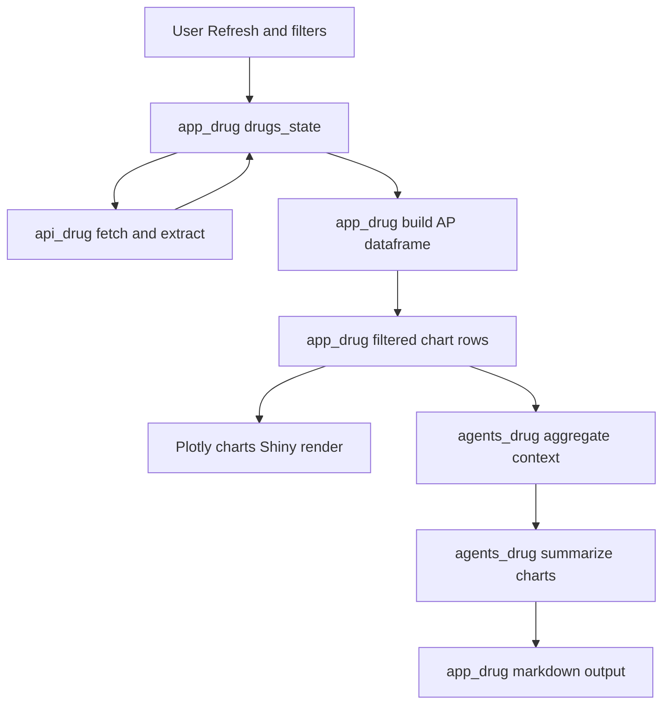
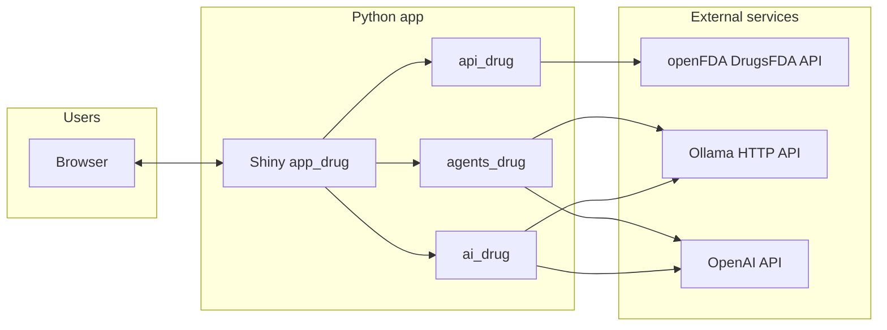
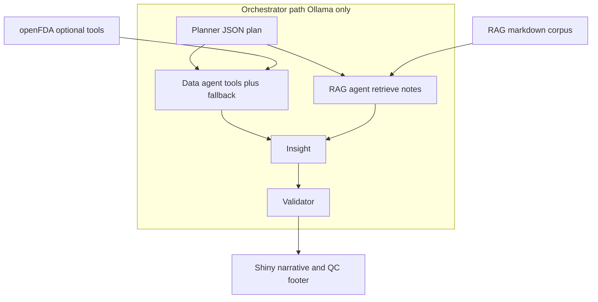
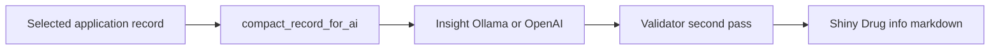

# System architecture — Drugs@FDA Explorer

This document describes how the **Shiny for Python** app (`app_drug.py`) loads FDA data, renders analytics, and calls optional LLM layers. Paths are relative to the `app/` directory unless noted.

---

## 1. End-to-end pipeline: openFDA request → user display

This is the **main spine** of the app: which **file** and **function** run from the HTTP call through what the user sees.

### 1.0 Configuration bootstrap

| File | What runs |
|------|-------------|
| **`env_load.py`** | Imported by `app_drug.py`, `api_drug.py`, `agents_drug.py`, and `ai_drug.py` so `.env` / `.env.txt` (API keys, hosts, `DASHBOARD_AI_ORCHESTRATOR`, etc.) are loaded before any network or LLM call. |

### 1.1 Step 1 — Request openFDA and normalize JSON

| File | Function | Role |
|------|----------|------|
| **`api_drug.py`** | **`fetch_drugsfda(limit, skip=0, …)`** | `requests.get` to `https://api.fda.gov/drug/drugsfda.json` using **`_params()`** (limit ≤ 1000, optional `OPENFDA_API_KEY`). Returns the raw **`payload`** dict. |
| **`api_drug.py`** | **`extract_results(payload)`** | For each element of `payload["results"]`, calls **`extract_record()`** and returns a **list of application dicts** (`application_number`, `sponsor_name`, `submissions`, `products`, …). |

### 1.2 Step 2 — Store in Shiny reactive state

| File | Function | Role |
|------|----------|------|
| **`app_drug.py`** | **`drugs_state()`** (`@reactive.calc`) | Invalidates on **`input.refresh()`** and **`input.fetch_limit()`**. Calls **`fetch_drugsfda`** → **`extract_results`**, returns **`{ ok, records, meta, error }`**. All downstream UI reads **`records`** from here. |

### 1.3 Step 3 — Build the analytics dataframe (charts + chart AI)

| File | Function | Role |
|------|----------|------|
| **`app_drug.py`** | **`approved_ap_df()`** | **`_build_approved_submissions_df(st["records"])`** — AP rows with parseable **`submission_status_date`** → **pandas** `DataFrame`. |
| **`app_drug.py`** | **`filtered_approved_for_charts()`** | Applies **`_filter_year`** and **`_filter_approved_kind`** from sidebar **`year_range`** and **`app_kind_filter`**. **Same `DataFrame`** powers every dashboard chart and the chart-AI context string. |

### 1.4 Step 4 — Draw dashboard charts (user sees figures)

| File | Where | Role |
|------|-------|------|
| **`app_drug.py`** | **`@render.ui`** outputs under the **Dashboard** nav | Build Plotly **`go.Figure`** KPIs and charts, **`_chart_layout`**, **`_fig_html`** (Plotly HTML + CDN) inside **bslib** cards. |

### 1.5 Step 5 — Drug Info cards (user sees structured drill-down)

| File | Function | Role |
|------|----------|------|
| **`app_drug.py`** | **`_sync_app_select()`** (`@reactive.effect`) | Fills **`input.selected_app`** from **`drugs_state()["records"]`**. |
| **`app_drug.py`** | **`drug_info_panel()`** (`@render.ui`) | Finds **`rec`** matching **`input.selected_app()`** in **`records`**, then helpers (**`_classify_application_kind`**, **`_flatten_active_ingredients`**, **`_dataframe_table_html`**, …) return **cards / tables** (no second HTTP call — data is already in memory). |

### 1.6 Step 6 — Chart Trends AI (optional)

| File | Function | Role |
|------|----------|------|
| **`app_drug.py`** | **`dashboard_chart_ai_panel()`** (`@render.ui`) | **`filtered_approved_for_charts()`** → **`aggregate_full_dashboard_context(...)`** in **`agents_drug.py`** → **`summarize_dashboard_charts(ctx, df=df)`**. |
| **`agents_drug.py`** | **`summarize_dashboard_charts`** | Orchestrator on: **`summarize_dashboard_charts_tool_rag`** (§3). Else: **`build_chart_explanation_prompt`** + **`_llm_chat`** / **`_ollama_generate`**. |
| **`app_drug.py`** | **`_ai_markdown_output(txt)`** | Renders the returned Markdown in the **Chart Trends — AI Summary** card. |

### 1.7 Step 7 — Drug Info AI (optional)

| File | Function | Role |
|------|----------|------|
| **`app_drug.py`** | **`drug_ai_summary_panel()`** (`@render.ui`) | Same **`rec`** as Drug Info cards → **`summarize_drug_application(rec)`** in **`ai_drug.py`**. |
| **`ai_drug.py`** | **`summarize_drug_application`** | **`build_insight_prompt`** → insight (**`call_ollama`** / **`call_openai`**) → validator (**`_ollama_chat_messages`** / **`_openai_chat_messages`** with **`_drug_validator_system`** / **`_drug_validator_user`**). Returns **narrative only** (no QC footer block). |
| **`app_drug.py`** | **`_ai_markdown_output(txt)`** | Renders Markdown in the **AI Summary — Selected Application** card. |

### 1.8 Reactive spine (diagram)

---

## 2. High-level context (systems)

**`env_load.py`** loads `.env` / `.env.txt` so API keys and hosts are available before HTTP calls (see §1.0).

---

## 3. Chart AI — two backends (`agents_drug.py`)

| Mode | Trigger | Behavior |
|------|---------|----------|
| **Template 3 (default)** | `DASHBOARD_AI_ORCHESTRATOR` unset / off | One LLM call: aggregated **CONTEXT** → short narrative (Ollama or OpenAI per `AI_BACKEND`). |
| **Orchestrator (advanced)** | `DASHBOARD_AI_ORCHESTRATOR=1` | **Ollama-only** multi-step flow: **Planner → Data (tools) → RAG (tool) → Insight → Validator**; optional **parallel** Data + RAG rounds when `DASHBOARD_AI_ORCH_PARALLEL=1`. Server-side **fallback** runs planned tools if the Data agent omits tool calls. Returns **final text + Markdown Quality control footer** + automated spot-checks. Agent traces print to **server stdout**. |

### 3.1 Orchestrator agents (dashboard chart AI)

**Agent 1: Planner**  
- **Role:** Decide what the later steps should do, not write the user-facing story.  
- **Output:** Strict JSON.

**Agent 2: Data**  
- **Role:** Gather tool-backed facts beyond the static context string (computed stats + optional API samples).  
- **Output:** Short bullets + caveats, not the final narrative.

**Agent 3: RAG**  
- **Role:** Pull interpretation guardrails from the bundled markdown corpus (`rag/drugsfda_dashboard_notes.md`).  
- **Output:** Ollama tool call to `retrieve_dashboard_notes`, then the model summarizes in a few bullets (what to stress / what not to claim).

**Agent 4: Insight**  
- **Role:** Write the first full stakeholder draft for the chart-AI box.  
- **Output:** Markdown-friendly 3–6 sentences or bullets.

**Agent 5: Validator**  
- **Role:** Quality-control editor on the Insight draft.  
- **Output:** Revised narrative that becomes what the user sees.

---

## 4. Drug info AI (`ai_drug.py`)

- **Insight** uses a single user prompt with embedded JSON. **Validator** receives the same **APPLICATION_JSON** blob plus the draft; output is the cleaned narrative **without** an appended QC footer (chart orchestrator still can append its own footer).

---

## 5. Module responsibilities

| Module | Responsibility |
|--------|------------------|
| **`app_drug.py`** | Shiny Express UI: sidebar controls, reactive `drugs_state`, chart builders, Drug info layout, tabbed **Dashboard / Drug info / About**, wires calls to `api_drug`, `agents_drug`, `ai_drug`. |
| **`api_drug.py`** | HTTP GET to `drug/drugsfda.json`, optional `OPENFDA_API_KEY`, extracts `results`, shared parsing helpers for records. |
| **`agents_drug.py`** | Dashboard context aggregation, Template 3 chart summary, optional orchestrator (tools + RAG + Insight + Validator + QC footer), CLI demos. |
| **`ai_drug.py`** | Compact record → insight prompt → validator pass; Ollama/OpenAI routing and fallbacks. |
| **`env_load.py`** | Dotenv-style load from app directory. |
| **`rag/drugsfda_dashboard_notes.md`** | Bundled text corpus for RAG retrieval in orchestrator mode only. |

---

## 6. Deployment note

The app is a standard **Shiny for Python** process (e.g. `shiny run app_drug.py` or Posit Connect). LLM calls originate **from the server** hosting the app (not the user’s browser), so **Ollama** must be reachable from that host unless only **OpenAI** is used.

---

## 7. Related docs

- **`README.md`** — install, env vars, run instructions.
- **`.env.example`** — template for `AI_BACKEND`, `OLLAMA_*`, `OPENAI_*`, `OPENFDA_API_KEY`, `DASHBOARD_AI_ORCHESTRATOR`, `DASHBOARD_AI_ORCH_PARALLEL`.

Repository layout for this folder: [sysen5381-tool `app/` on GitHub](https://github.com/joninguyen12/sysen5381-tool/tree/main/app).
