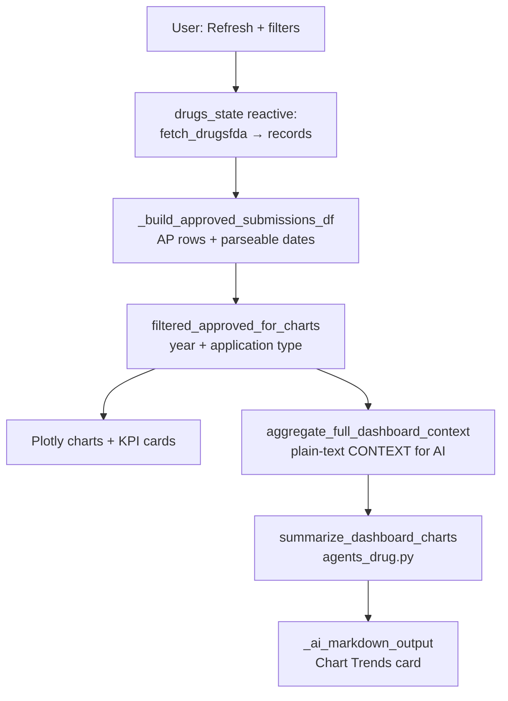
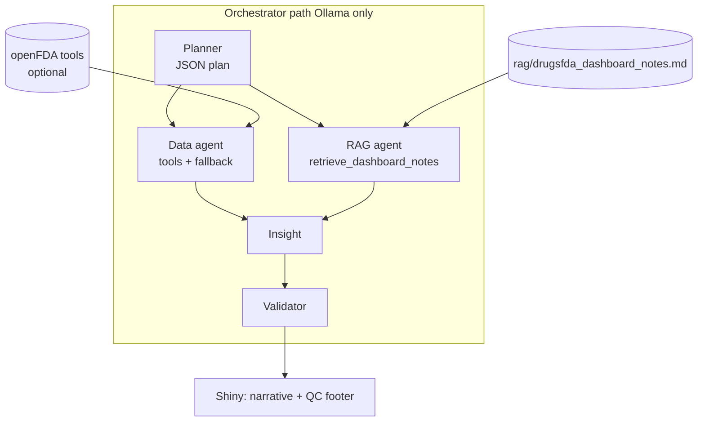
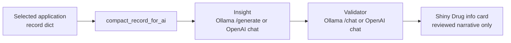

# System architecture — Drugs@FDA Explorer

This document describes how the **Shiny for Python** app (`app_drug.py`) loads FDA data, renders analytics, and calls optional LLM layers. Paths are relative to the `app/` directory unless noted.

---

## 1. High-level context

```mermaid
flowchart LR
  subgraph users [Users]
    U[Browser]
  end
  subgraph app [Python app]
    S[Shiny UI\napp_drug.py]
    A[api_drug.py]
    G[agents_drug.py]
    I[ai_drug.py]
  end
  subgraph external [External services]
    FDA[(openFDA\nDrugs@FDA API)]
    OLL[(Ollama\n/api/chat /api/generate)]
    OAI[(OpenAI\nChat Completions)]
  end
  U <--> S
  S --> A
  A --> FDA
  S --> G
  S --> I
  G --> OLL
  G --> OAI
  I --> OLL
  I --> OAI
```

**`env_load.py`** loads `.env` / `.env.txt` so API keys and hosts are available before HTTP calls.

---

## 2. Runtime data flow (dashboard)



- **Single source of truth for charts and chart AI:** the same filtered **AP** dataframe pipeline drives visuals and the aggregated context string.

---

## 3. Chart AI — two backends (`agents_drug.py`)

| Mode | Trigger | Behavior |
|------|---------|----------|
| **Template 3 (default)** | `DASHBOARD_AI_ORCHESTRATOR` unset / off | One LLM call: aggregated **CONTEXT** → short narrative (Ollama or OpenAI per `AI_BACKEND`). |
| **Orchestrator (advanced)** | `DASHBOARD_AI_ORCHESTRATOR=1` | **Ollama-only** multi-step flow: **Planner → Data (tools) → RAG (tool) → Insight → Validator**; optional **parallel** Data + RAG rounds when `DASHBOARD_AI_ORCH_PARALLEL=1`. Server-side **fallback** runs planned tools if the Data agent omits tool calls. Returns **final text + Markdown Quality control footer** + automated spot-checks. Agent traces print to **server stdout**. |



### 3.1 Orchestrator agents (dashboard chart AI)

**Agent 1: Planner**  
- **Role:** Decide what the later steps should do, not write the user-facing story.  
- **Output:** Strict JSON.

**Agent 2: Data**  
- **Role:** Gather tool-backed facts beyond the static context string (computed stats + optional API samples).  
- **Output:** Short bullets + caveats, not the final narrative.

**Agent 3: RAG**  
- **Role:** Pull interpretation guardrails from the bundled markdown corpus (`rag/drugsfda_dashboard_notes.md`).  
- **Output:** Ollama tool call to `retrieve_dashboard_notes`, then the model summarizes in a few bullets (what to stress / what not to claim).

**Agent 4: Insight**  
- **Role:** Write the first full stakeholder draft for the chart-AI box.  
- **Output:** Markdown-friendly 3–6 sentences or bullets.

**Agent 5: Validator**  
- **Role:** Quality-control editor on the Insight draft.  
- **Output:** Revised narrative that becomes what the user sees.

---

## 4. Drug info AI (`ai_drug.py`)



- **Insight** uses a single user prompt with embedded JSON. **Validator** receives the same **APPLICATION_JSON** blob plus the draft; output is the cleaned narrative **without** an appended QC footer (chart orchestrator still can append its own footer).

---

## 5. Module responsibilities

| Module | Responsibility |
|--------|------------------|
| **`app_drug.py`** | Shiny Express UI: sidebar controls, reactive `drugs_state`, chart builders, Drug info layout, tabbed **Dashboard / Drug info / About**, wires calls to `api_drug`, `agents_drug`, `ai_drug`. |
| **`api_drug.py`** | HTTP GET to `drug/drugsfda.json`, optional `OPENFDA_API_KEY`, extracts `results`, shared parsing helpers for records. |
| **`agents_drug.py`** | Dashboard context aggregation, Template 3 chart summary, optional orchestrator (tools + RAG + Insight + Validator + QC footer), CLI demos. |
| **`ai_drug.py`** | Compact record → insight prompt → validator pass; Ollama/OpenAI routing and fallbacks. |
| **`env_load.py`** | Dotenv-style load from app directory. |
| **`rag/drugsfda_dashboard_notes.md`** | Bundled text corpus for RAG retrieval in orchestrator mode only. |

---

## 6. Deployment note

The app is a standard **Shiny for Python** process (e.g. `shiny run app_drug.py` or Posit Connect). LLM calls originate **from the server** hosting the app (not the user’s browser), so **Ollama** must be reachable from that host unless only **OpenAI** is used.

---

## 7. Related docs

- **`README.md`** — install, env vars, run instructions.
- **`.env.example`** — template for `AI_BACKEND`, `OLLAMA_*`, `OPENAI_*`, `OPENFDA_API_KEY`, `DASHBOARD_AI_ORCHESTRATOR`, `DASHBOARD_AI_ORCH_PARALLEL`.

Repository layout for this folder: [sysen5381-tool `app/` on GitHub](https://github.com/joninguyen12/sysen5381-tool/tree/main/app).
