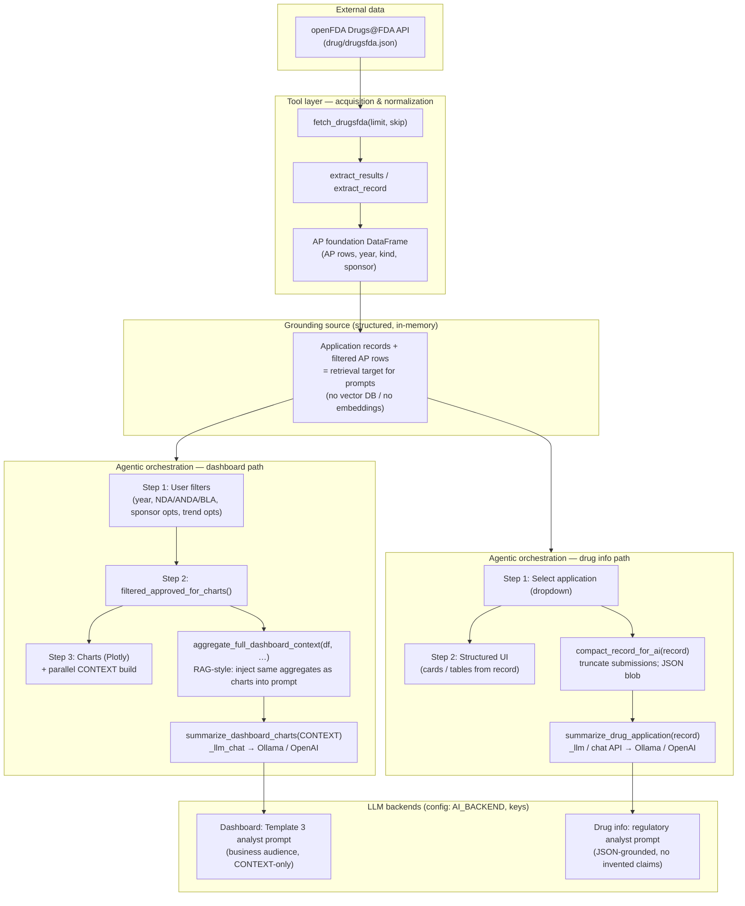

# Drugs@FDA dashboard — data flow, orchestration, grounding & tools

This diagram is **digital** (Mermaid). It maps **assignment language** (agentic orchestration, RAG-style grounding, tools) to what the app implements in `app_drug.py`, `api_drug.py`, `agents_drug.py`, and `ai_drug.py`.

**Implementation note (accuracy):** the LLM does **not** call tools via OpenAI function-calling or similar at runtime. **Tools** here are **application-layer functions** chained in code. **Grounding** is **structured tabular/text context** built from the API and filtered DataFrames—not embedding search over a vector store.

## Legend

| Term in rubric | What this app does |
|----------------|-------------------|
| **Data flow** | openFDA → fetch/extract → AP-level records → filters → charts and/or drug detail. |
| **Agentic orchestration** | **Sequential pipeline**: filter → aggregate/context **or** compact record → single LLM call per button (Explain chart trends / Generate AI summary). Not a multi-agent swarm; aligns with a **single analyst step** after deterministic prep. |
| **RAG** | **Structured grounding**: prompts are filled from **retrieved fields** (same `DataFrame` metrics as charts; compact JSON for one application). **No** chunk retrieval from a vector index. |
| **Tool calling** | **Programmatic tools** (`fetch_drugsfda`, aggregation, summarizers) invoked by **Shiny/app code**, not by the model choosing functions at runtime. |

To render: paste the `flowchart` block into [Mermaid Live](https://mermaid.live) or any Markdown viewer with Mermaid support.
